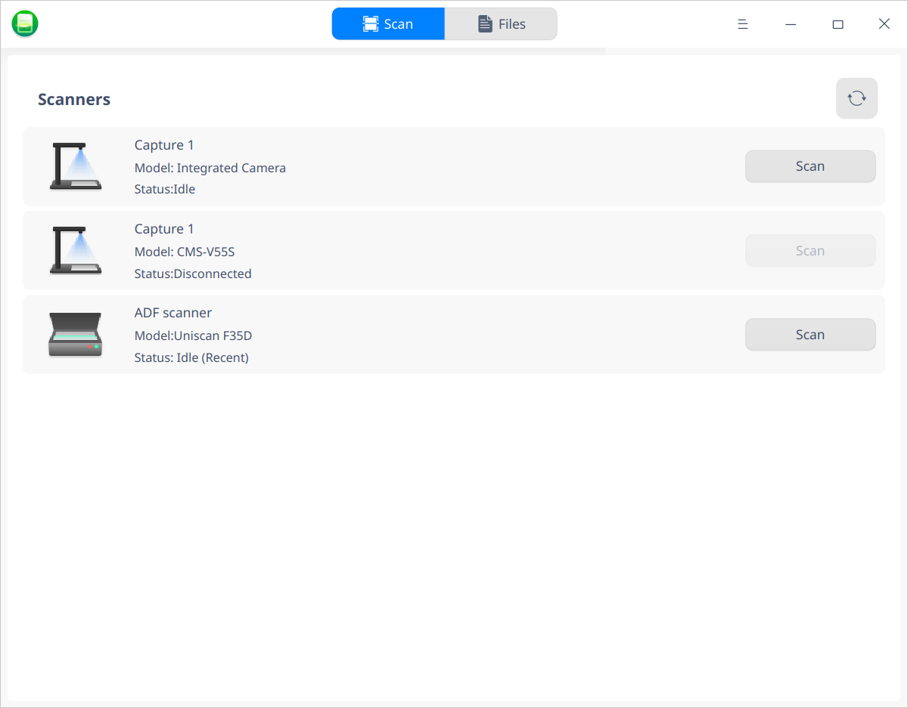
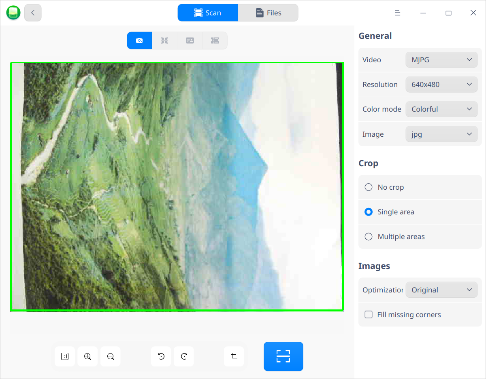
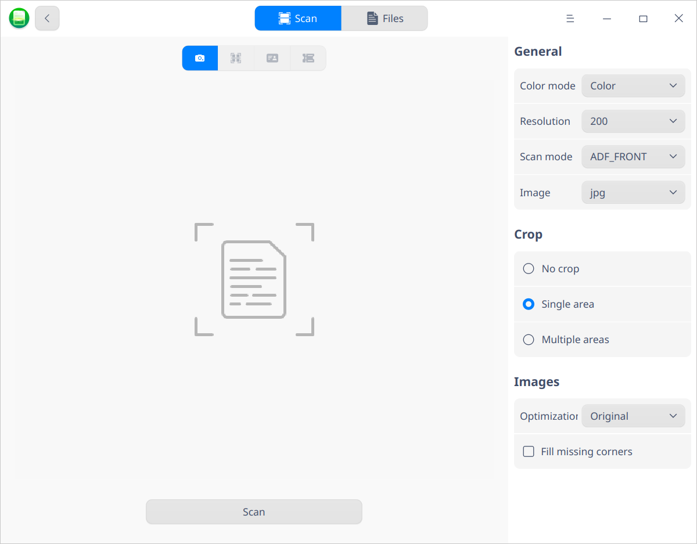
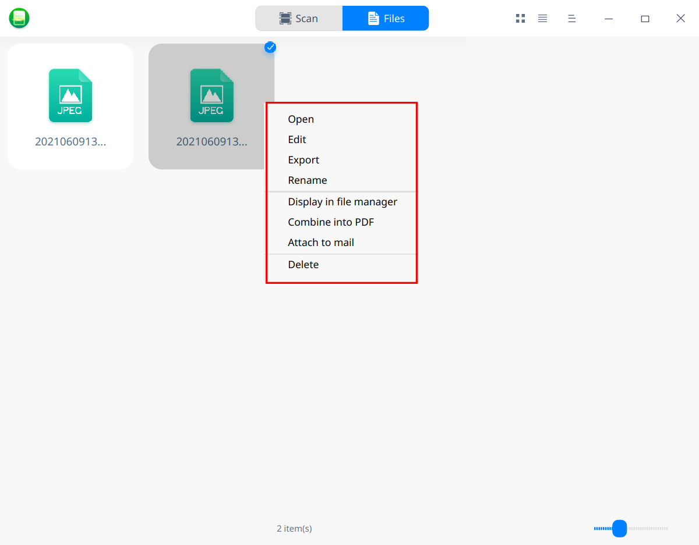
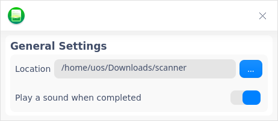

# Scan Assistant|deepin-scanner|

## Overview 

Scan Assistant is a tool for managing several scanning devices at a time. The interface is visual and easy to operate. 

## Guide

You can run, close or create a shortcut of Scan Assistant as follows.

### Run Scan Assistant

1. Click    in the lower left corner of the dock to enter launcher interface.
2. Locate  by scrolling the mouse wheel or searching "Scan Assistant" in the Launcher interface and click it to run. 
3. Right-click to:
   - Select **Send to desktop** to create a shortcut on the desktop.
   - Select **Send to dock** to fix it onto the dock.
   - Select **Add to startup** to add it to startup. When the computer starts up, Scan Assistant runs automatically.

### Exit Scan Assistant

- On Scan Assistant interface, click  to exit.
- Right-clickon Dock and select  **Close All** to exit.
- On Scan Assistant interface, click   and select  **Exit**.

## Operations

Connect a scanning device to your computer and turn it on. 

Open Scan Assistant. The system will detect the devices connected currently, such as captures and scanners.  If the device list is not displayed, corresponding driver needs to be installed.

### Installing drivers

1. Download driver package (.deb) from the official website for the scanner.
2. Double-click the package, Package Installer starts up automatically and get ready to install it.
3. After the driver is installed successfully, click  to confirm if the scanner is displayed in the list or not. 

### Capture

1. After selecting the capture in the device list and click **Scan**, to enter the scanning interface.
2. Scanning parameters can be set in the right side of the interface, including general settings, cropping and image processing scheme.

   **General**: you can set resolution, format(i.e. image format, jpg/bmp/tif/png, as well as PDF file format) and color mode(colorful, grey, black and white) here. 

   **Crop**: The default setting is "no crop", but you can select "single area" or "multiple areas". If "multiple areas" is selected, you can shoot multiple files at the same time and cut them into multiple pictures.

   **Images**: When you have selected either "single area" or "multiple areas", may this function is available. For example, if "red seal" is selected, the document containing red seals could be clearer.

   

3. You can set 1:1 display scale, zoom in/out, rotate and crop the scanning area at the bottom of the interface.

4. After the above mentioned settings are done, click the scan button . The captured images would be viewed in "Files" tab.

### Scanner

1. After selecting the scanner in the device list and click **Scan**,to enter the scanning interface.
2. Scanning parameters can be set in the right side of the interface, including general settings, cropping and image processing scheme.

   **General**: you can set mode(color24, gray8, lineart), source(ADF_FRONT, ADF_DUPLEX, FLAT_FRONT), resolution, and image here.

   **Crop**: The default setting is "no crop", but you can select "single area" or "multiple areas". If "multiple areas" is selected, you can shoot multiple files at the same time and cut them into multiple pictures.

   **Images**: When you have selected either "single area" or "multiple areas", may this function is available. For example, if "red seal" is selected, the document containing red seals could be clearer.

   

   

3. After the above mentioned settings are done, click the **Scan** button. The scanned image would be viewed in "Files" tab.

### Image processing

1. Click **Files** in the main interface of Scan Assistant, all scanned images would be displayed. You can click  or to view them in icon view or list view.

2. Select an image and right-click, you can edit, export, rename, display in file manager, combine into PDF, attach to mail, and delete it.

   

   - Edit: select this function to edit it in Draw. 

   - Export: select this function to export directly. If there are many pictures, you can combine them into PDF first, and then export them to the folder in the specified location.
   - Rename: select this function to rename it, so as to make it easy to find. 
   - Display in file manager: select this function to open the folder where the image is stored.
   - Attach to mail: all scanned images could be sent in mails. If there are many pictures, you can combine them into PDF first, and then attach them to mail.

## Main Menu

In the main menu, you can do settings, switch window themes, view manual and get more information about Scan Assistant.

### Settings

1. Click on the interface.

2. Click **Settings** to set up the storing location, and switch on/off **Play a sound when completed**. 

   

### Theme

The window theme includes Light Theme, Dark Theme and System Theme.

1.   Click on the interface.
2.   Click **Theme** to select a theme.

### Help

You can click to view the manual, which will help you further know and use Scan Assistant.

1. Click on the interface.
2. Click **Help**.
3. View the manual.

### About

1. Click on the interface.
2. Click **About**.
3. View the version description.

### Exit

1. Click on the interface.
2. Click **Exit**.