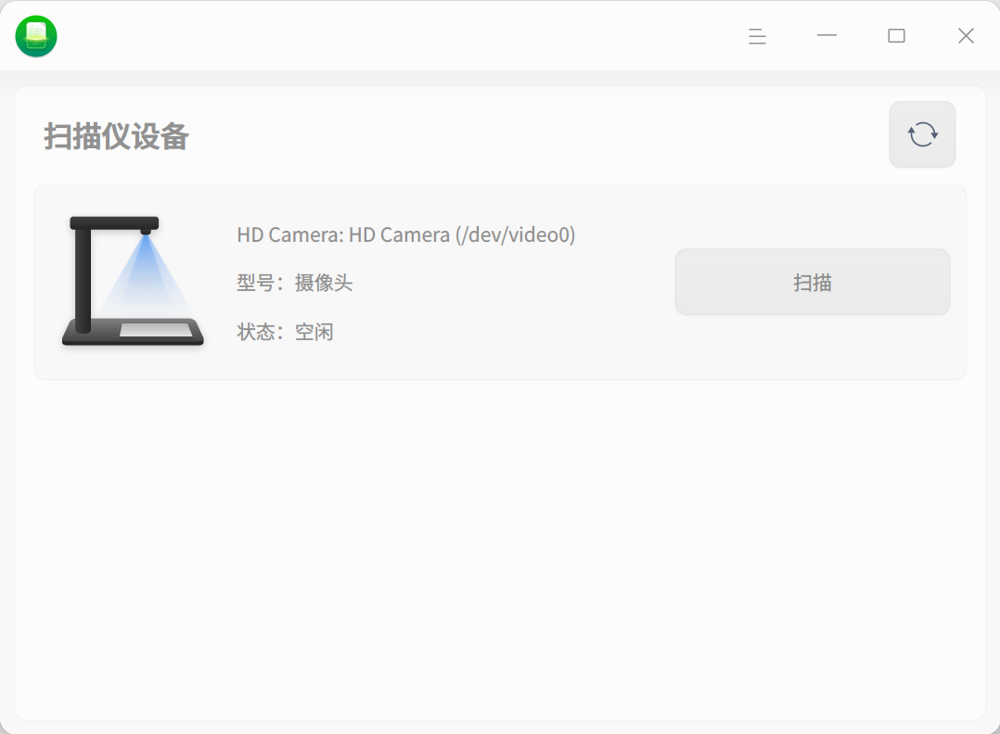

# Scan Manager|deepin-scanner|

## Overview
The Scan Manager is a tool for managing scanning devices, which can manage multiple scanning devices simultaneously. The page is visualized and the operation is simple.

## Getting Started
You can run or close the Scan Manager, or create a shortcut in the following ways.
### Running the Scan Manager
1.  Click the launcher icon on the taskbarto enter the launcher page.
2.  Scroll the mouse wheel up and down to browse or search to find the Scan Manager, and click to run.
3.  Right-click on, and you can:
*   Click **Send to Desktop** to create a shortcut on the desktop.
*   Click **Send to Taskbar** to pin the application to the taskbar.
*   Click **Start Automatically at Boot** to add the application to the startup items, so that the application will run automatically when the computer boots up.

### Closing the Scan Manager
*   Clickon the Scan Manager page to exit the Scan Manager.
*   Right-click onon the taskbar and select **Close All** to exit the Scan Manager.
*   Click  on the Scan Manager page and select **Exit** to exit the Scan Manager.

## Introduction to Scanning Operations
Connect the scanning device to the computer and turn on the switch of the scanning device.
Open the Scan Manager, and the system will automatically scan all the scanning devices connected to the current computer, such as cameras and scanners. If the corresponding device list is not displayed, you need to install the driver.

### Installing the Driver
1.  Download the corresponding .deb driver installation package for the scanning device on the official website.
2.  Double-click the driver installation package, and the software package installer will automatically start and prepare to install the software package.
3.  After the driver is successfully installed, click the refresh buttonto confirm that the device is displayed in the list.

### Camera
1.  Select the camera in the device list and click **Scan** to enter the scanning page.
2.  Set the scanning parameters on the right side of the page, including scanning settings, cropping, and image processing schemes.
    **Scanning Settings**: Set the resolution, color mode, and image format of the scanned picture. Currently, three color modes of color/grayscale/black and white are supported, four image formats of jpg/bmp/tif/png are supported, and scanning to pdf and ofd documents is also supported.
    
3.  After completing the settings, click the scan button, and the scanned pictures can be viewed in "View Scanned Images".

## Main Menu
In the main menu, you can switch the window theme, view the help manual, etc.

### Theme
The window theme includes the light theme, the dark theme, and the system theme.
1.  On the Scan Manager page, click.
2.  Click **Theme** and select a theme color.

### Help
1.  On the Scan Manager page, click.
2.  Click **Help** to view the help manual and further understand and use the Scan Manager.

### About
1.  On the Scan Manager page, click.
2.  Click **About** to view the version and introduction of the Scan Manager.

### Exit
1.  On the Scan Manager page, click.
2.  Click **Exit**.
