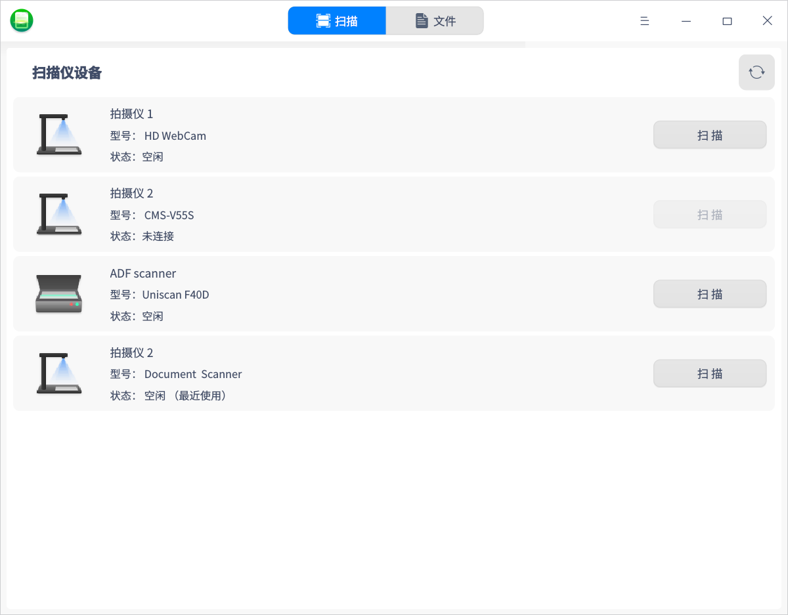
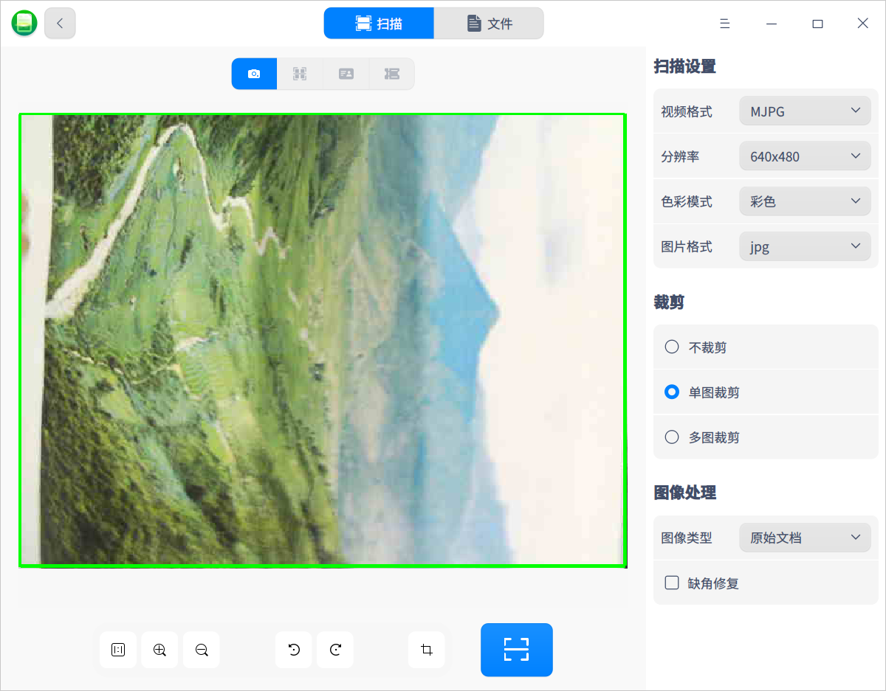
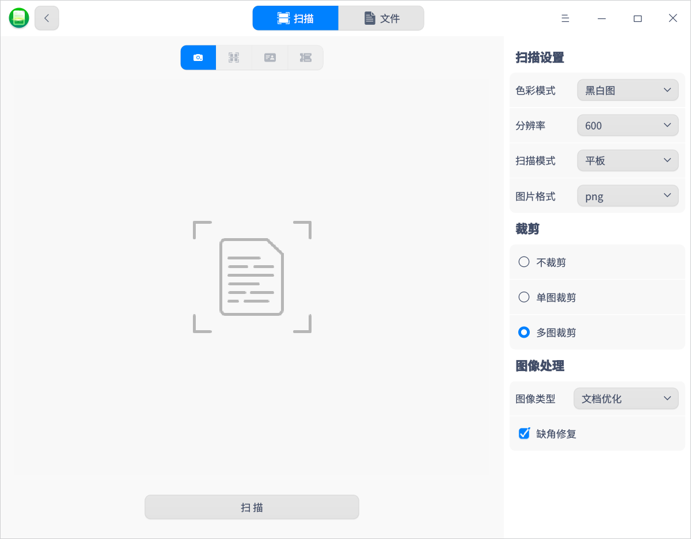
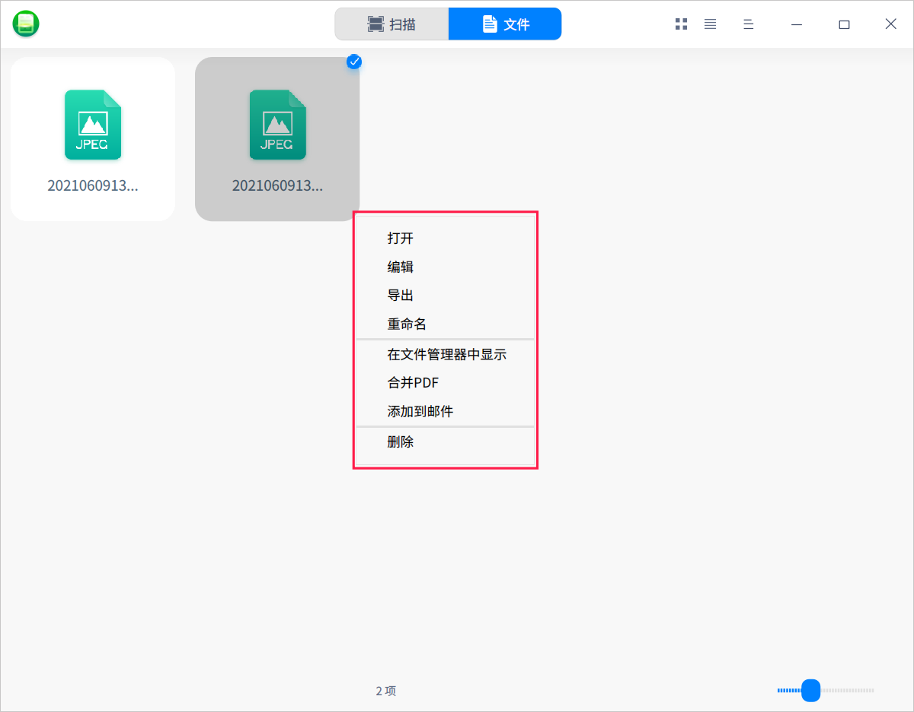
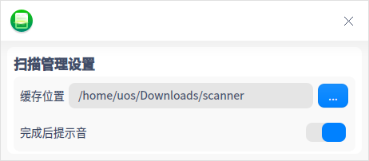

# 扫描管理器|deepin-scanner|

## 概述

扫描管理器是一款管理扫描设备的工具，可同时管理多个扫描设备。页面可视化，操作简单。

## 使用入门

您可以通过以下方式运行或关闭扫描管理器，或者创建快捷方式。

### 运行扫描管理器

1. 单击任务栏上的启动器图标 ，进入启动器页面。
2. 上下滚动鼠标滚轮浏览或通过搜索，找到扫描管理器图标  ，单击运行。
3. 右键单击 ，您可以：
   - 单击 **发送到桌面**，在桌面创建快捷方式。

   - 单击 **发送到任务栏**，将应用程序固定到任务栏。

   - 单击 **开机自动启动**，将应用程序添加到开机启动项，在电脑开机时自动运行该应用程序。

### 关闭扫描管理器

- 在扫描管理器页面单击   ，退出扫描管理器。
- 右键单击任务栏上的 ，选择 **关闭所有** 来退出扫描管理器。
- 在扫描管理器页面单击  ，选择 **退出** 来退出扫描管理器。

## 扫描操作介绍

将扫描设备与电脑连接，并打开扫描设备的开关。

打开扫描管理器，系统会自动扫描当前电脑上连接的所有扫描设备，如拍摄仪和扫描仪。如果没有显示对应的设备列表，则需要安装驱动。

### 安装驱动

1. 在官网下载扫描设备对应的.deb驱动安装包。
2. 双击驱动安装包，软件包安装器会自动启动并准备安装该软件包。
3. 驱动安装成功后，单击刷新按钮确认设备显示在列表中。

### 拍摄仪

1. 在设备列表中选择拍摄仪并单击 **扫描**，进入扫描页面。

2. 在页面右侧设置扫描参数，包括扫描设置、裁剪及图像处理方案等。

   **扫描设置**：设置扫描图片的分辨率、色彩模式及图片格式。当前支持彩色/灰度/黑白三种色彩模式，支持jpg/bmp/tif/png四种图片格式，且支持扫描为pdf文档。

   **裁剪**：默认为不裁剪，可以选择单图裁剪或多图裁剪。例如选择 "多图裁剪" 后，如果此文件显示了多张图片，则可以裁剪为多张图片。

   **图像处理**：当裁剪方式为单图裁剪或多图裁剪时，才可以设置图像处理方式。例如选择 "红印文档优化" 可以使红印文件的印章更加清晰。

   

3. 在页面底部设置显示比例，放大或缩小，旋转及剪裁扫描区域。

4. 完成设置后，单击扫描按钮，扫描的图片可以在 “文件” 页面查看。

### 扫描仪

1. 在设备列表中选择扫描仪并单击 **扫描**，进入扫描页面。

2. 在页面右侧可以设置扫描参数，包括扫描设置、裁剪及图像处理方案等。

   **扫描设置**：设置色彩模式、扫描模式、分辨率及图片格式。当前支持彩色图/灰度图/黑白图三种色彩模式，支持ADF正面/ADF双面/平板三种扫描模式等。

   **裁剪**：默认为不裁剪，可选择单图裁剪或多图裁剪。例如选择 "多图裁剪" 后，如果此文件显示了多张图片，则可以裁剪为多张图片。

   **图像处理**：当裁剪方式为单图裁剪或多图裁剪时，才可以设置图像处理方式。例如选择 "红印文档优化" 可以使红印文件的印章更加清晰。

   

3. 完成设置后，单击 **扫描**，扫描的图片可以在“文件”页面查看。

### 图片处理

1. 在扫描管理器主页面单击 **文件** 会显示扫描完的所有图片，单击图标/列表视图、，以图标或列表形式查看图片。

2. 选中图片并单击右键，可以进行编辑、导出、重命名、合并PDF、添加到邮件、删除等操作。

   

   - 编辑：在画板中编辑图片。
   - 导出：将图片导出到指定的文件夹，如果图片较多可以先合并为PDF再导出。
   - 重命名：对图片进行重命名，便于识别。
   - 在文件管理器中显示：直接打开图片所在的文件夹。
   - 添加到邮件：通过邮件发送图片，如果图片较多可以先合并为PDF文件再发送。

## 主菜单

在主菜单中，可以进行扫描管理设置、切换窗口主题，查看帮助手册等。

### 设置

1. 在扫描管理器页面，单击 。

2. 单击 **设置**，设置扫描文件的缓存位置，选择是否开启”完成后提示音“功能。

   

### 主题

窗口主题包含浅色主题、深色主题和系统主题。

1. 在扫描管理器页面，单击。
2. 单击 **主题**，选择一个主题颜色。

### 帮助

1. 在扫描管理器页面，单击 。
2. 单击 **帮助**，查看帮助手册，进一步了解和使用扫描管理器。

### 关于

1. 在扫描管理器页面，单击 。
2. 单击 **关于**，查看扫描管理器的版本和介绍。

### 退出

1. 在扫描管理器页面，单击 。
2. 单击 **退出**。

