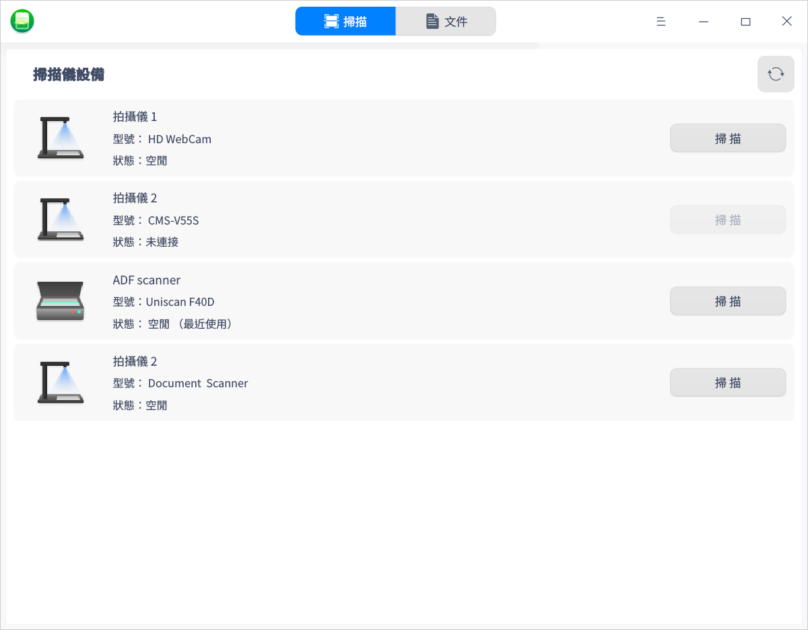
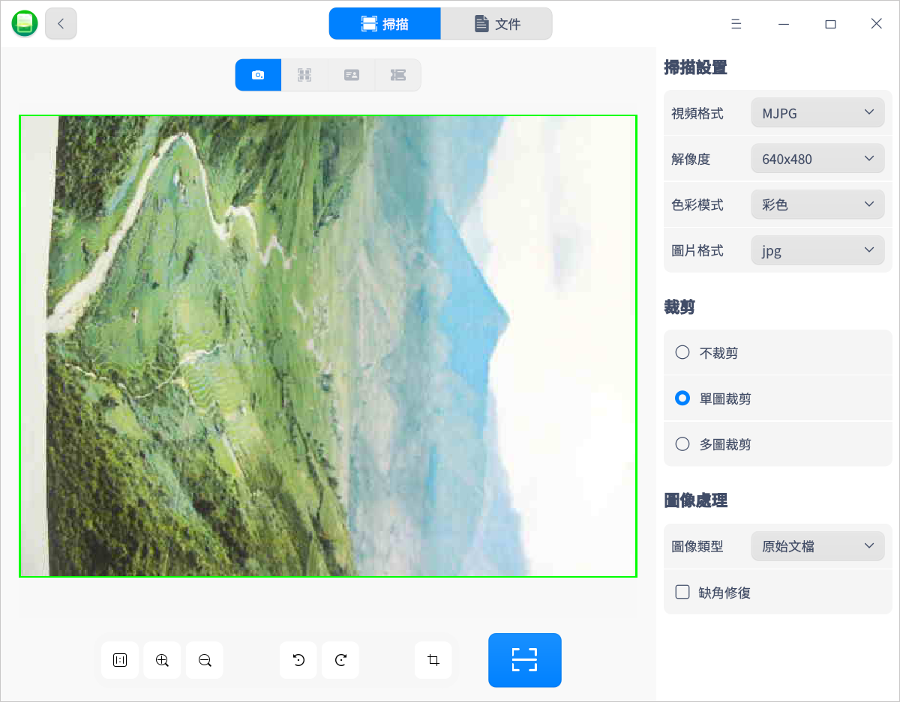
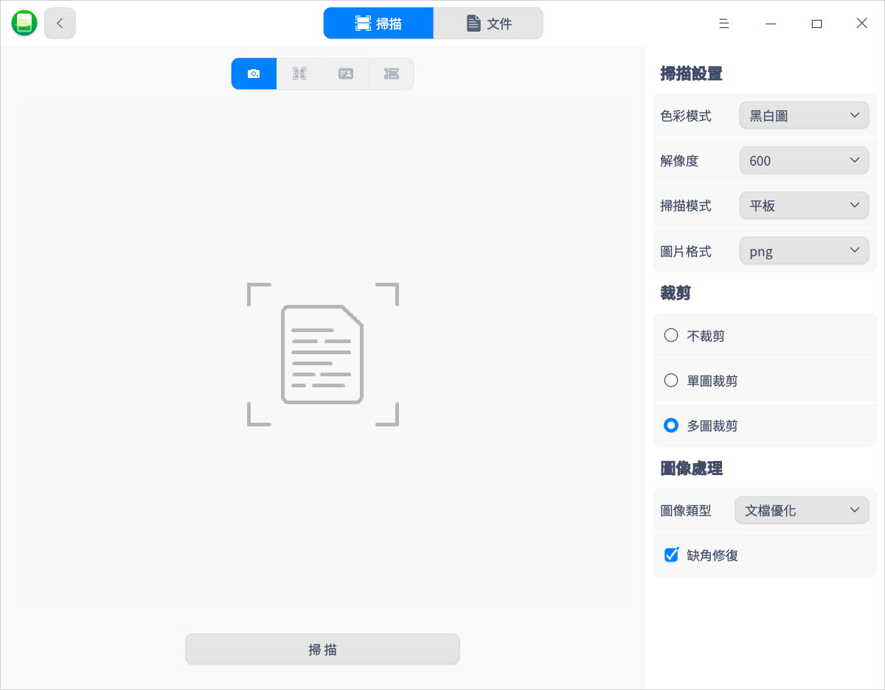
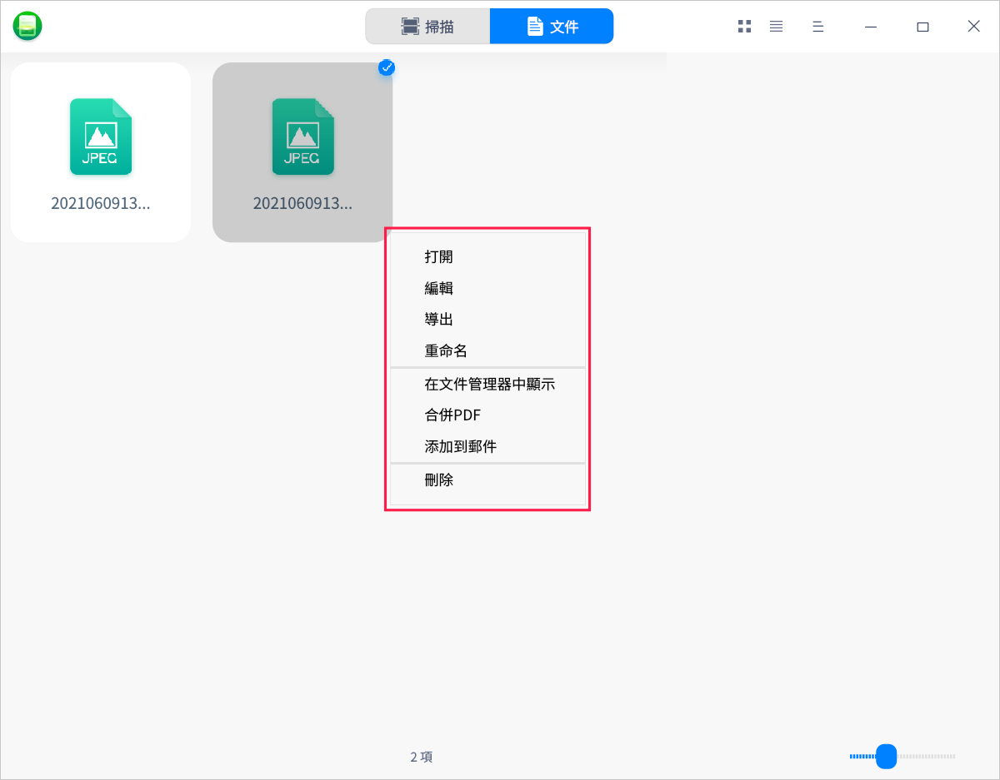
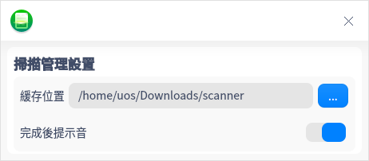

# 掃描管理器|deepin-scanner|

## 概述

掃描管理器是一款管理掃描設備的工具，可同時管理多個掃描設備。界面可視化，操作簡單。

## 使用入門

您可以通過以下方式運行或關閉掃描管理器，或者創建快捷方式。

### 運行掃描管理器

1. 單擊任務欄上的啟動器圖標  ，進入啟動器界面。
2. 上下滾動鼠標滾輪瀏覽或通過搜索，找到掃描管理器圖標 ，單擊運行。
3. 右鍵單擊 ，您可以：
   - 單擊 **傳送到桌面**，在桌面創建快捷方式。
   - 單擊 **傳送到任務欄**，將應用程序固定到任務欄。
   - 單擊 **加至開機啟動**，將應用程序添加到開機啟動項，在電腦開機時自動運行該應用程序。

### 關閉掃描管理器

- 在掃描管理器界面單擊 ，退出掃描管理器。
- 右鍵單擊任務欄上的  ，選擇 **關閉所有** 來退出掃描管理器。
- 在掃描管理器界面單擊 ，選擇 **退出** 來退出掃描管理器。

## 掃描操作介紹

將掃描設備與電腦連接，並打開掃描設備的開關。

打開掃描管理器，系統會自動掃描當前電腦上連接的所有掃描設備，如拍攝儀和掃描儀。如果沒有顯示對應的設備列表，則需要安裝驅動。

### 安裝驅動

1. 在官網下載掃描設備對應的.deb驅動安裝包。
2. 雙擊驅動安裝包，軟件包安裝器會自動啟動並準備安裝該軟件包。
3. 驅動安裝成功後，單擊刷新按鈕確認設備顯示在列表中。

### 拍攝儀

1. 在設備列表中選擇拍攝儀並單擊 **掃描**，進入掃描界面。

2. 在界面右側設置掃描參數，包括掃描設置、裁剪及圖像處理方案等。

   **掃描設置**：設置掃描圖片的解像度、色彩模式及圖片格式。當前支持彩色/灰度/黑白三種色彩模式，支持jpg/bmp/tif/png四種图片格式，且支持掃描為pdf文件。

   **裁剪**：默認為不裁剪，可以選擇單圖裁剪或多圖裁剪。例如選擇 「多圖裁剪」 後，如果此文件顯示了多張圖片，則可以裁剪為多張圖片。

   **圖像處理**：當裁剪方式為單圖裁剪或多圖裁剪時，才可以設置圖像處理方式。例如選擇「紅印文檔優化」可以使紅印文件的印章更加清晰。

   
   &nbsp;&nbsp;&nbsp;&nbsp;&nbsp;&nbsp;&nbsp;&nbsp;&nbsp;&nbsp;&nbsp;&nbsp;&nbsp;
   
3. 在界面底部設置顯示比例，放大或縮小，旋轉及剪裁掃描區域。

4. 完成設置後，單擊掃描按鈕，掃描的圖片可以在「文件」 界面查看。

### 掃描儀

1. 在設備列表中選擇掃描儀並單擊 **掃描**，進入掃描界面。

2. 在界面右側設置掃描參數，包括掃描設置、裁剪及圖像處理方案等。

   **掃描設置**：可設置色彩模式、掃描模式、分辨率及圖片格式。當前支持彩色圖/灰度圖/黑白圖三種色彩模式，支持ADF正面/ADF雙面/平板三種掃描模式等。

   **裁剪**：默認為不裁剪，可以選擇單圖裁剪或多圖裁剪。例如選擇 「多圖裁剪」 後，如果此文件顯示了多張圖片，則可以裁剪為多張圖片。

   **圖像處理**：當裁剪方式為單圖裁剪或多圖裁剪時，才可以設置圖像處理方式。例如選擇「紅印文檔優化」可以使紅印文件的印章更加清晰。

   
   &nbsp;&nbsp;&nbsp;&nbsp;&nbsp;&nbsp;&nbsp;&nbsp;&nbsp;&nbsp;&nbsp;&nbsp;&nbsp;
   
3. 完成設置後，單擊 **掃描**，掃描的圖片可以在「文件」 界面查看。

### 圖片處理

1. 在掃描管理器主界面單擊 **文件** 會顯示掃描完的所有圖片，單擊圖標/列表視圖按鈕 、，以圖標或列表形式查看圖片。

2. 選中圖片並右鍵單擊，可以進行編輯、導出、重命名、合併PDF、添加到郵件、刪除等操作。

   
   &nbsp;&nbsp;&nbsp;&nbsp;&nbsp;&nbsp;&nbsp;&nbsp;&nbsp;&nbsp;&nbsp;&nbsp;&nbsp;
   - 編輯：掃描完的圖片可以在畫板中編輯。
   - 導出：掃描完的圖片可以直接導出，如果圖片較多可以先合併為PDF，再導出到指定位置的文件夾。
   - 重命名：對掃描完的圖片進行重命名，便於查找。
   - 在文件管理器中顯示：直接打開圖片所在的文件夾。
   - 添加到郵件：掃描完的圖片可以通過郵件發出，如果圖片較多可以先合併為PDF文件，再通過郵件發出。

## 主菜單

在主菜單中，您可以進行掃描管理設置、切換窗口主題，查看幫助手冊等操作。

### 設置

1. 在掃描管理器界面，單擊 。
2. 單擊 **設置**，您可以設置掃描文件的緩存位置，選擇是否開啟「完成後提示音」功能。

### 主題

窗口主題包含淺色主題、深色主題和系統主題。

1. 在掃描管理器界面，單擊。
2. 單擊 **主題**，選擇一個主題顏色。

### 幫助

1. 在掃描管理器界面，單擊 。
2. 單擊 **幫助**，查看幫助手冊，進一步了解和使用掃描管理器。

### 關於

1. 在掃描管理器界面，單擊 。
2. 單擊 **關於**，查看掃描管理器的版本和介紹。

### 退出

1. 在掃描管理器界面，單擊 。
2. 單擊 **退出**。