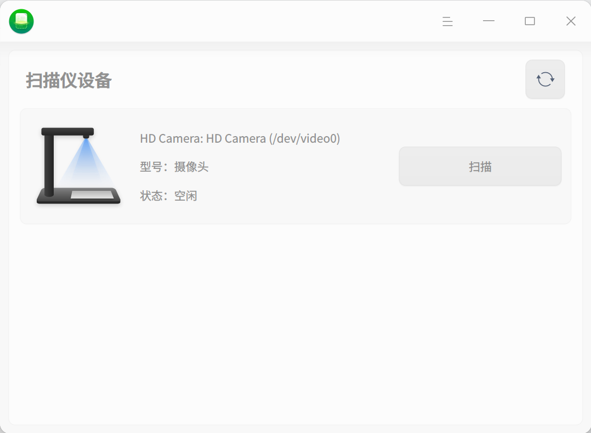
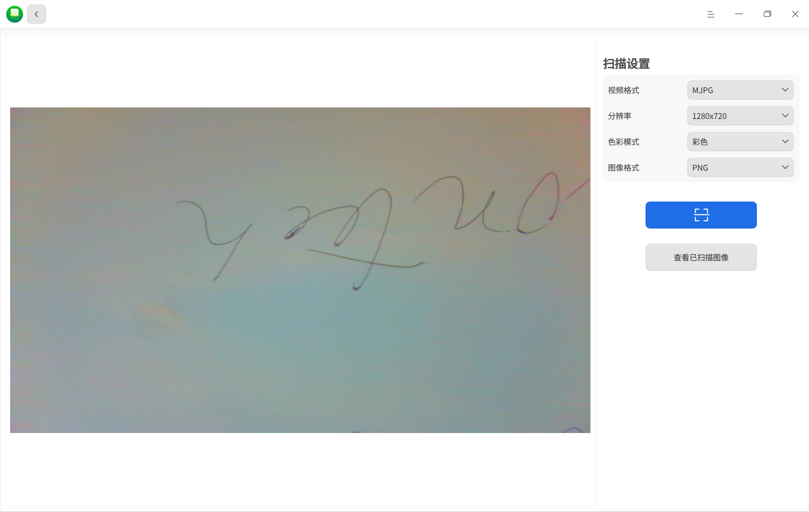

# 掃描管理器|deepin-scanner|

## 概述

掃描管理器是一款管理掃描設備的工具，可同時管理多個掃描設備。頁面可視化，操作簡單。

## 使用入門

您可以透過以下方式運行或關閉掃描管理器，或者創建快捷方式。

### 運行掃描管理器

1.  單擊任務欄上的啟動器圖標，進入啟動器頁面。
2.  上下滾動滑鼠滾輪瀏覽或透過搜索，找到掃描管理器圖標，單擊運行。
3.  右鍵單擊，您可以：
*   單擊 **發送到桌面**，在桌面創建快捷方式。
*   單擊 **發送到任務欄**，將應用程式固定到任務欄。
*   單擊 **開機自動啟動**，將應用程式添加到開機啟動項，在電腦開機時自動運行該應用程式。

### 關閉掃描管理器
*   在掃描管理器頁面單擊，退出掃描管理器。
*   右鍵單擊任務欄上的，選擇 **關閉所有** 來退出掃描管理器。
*   在掃描管理器頁面單擊  ，選擇 **退出** 來退出掃描管理器。

## 掃描操作介紹
將掃描設備與電腦連接，並打開掃描設備的開關。
打開掃描管理器，系統會自動掃描當前電腦上連接的所有掃描設備，如拍攝儀和掃描儀。如果沒有顯示對應的設備列表，則需要安裝驅動。

### 安裝驅動

1.  在官網下載掃描設備對應的.deb 驅動安裝包。
2.  雙擊驅動安裝包，軟件包安裝器會自動啟動並準備安裝該軟件包。
3.  驅動安裝成功後，單擊刷新按鈕確認設備顯示在列表中。

### 拍攝儀
1.  在設備列表中選擇拍攝儀並單擊 **掃描**，進入掃描頁面。
2.  在頁面右側設置掃描參數，包括掃描設置、裁剪及圖像處理方案等。
    **掃描設置**：設置掃描圖片的分辨率、色彩模式及圖片格式。當前支持彩色 / 灰度 / 黑白三種色彩模式，支持 jpg/bmp/tif/png 四種圖片格式，且支持掃描為 pdf、ofd 文檔。
    
3.  完成設置後，單擊掃描按鈕，掃描的圖片可以在 “查看已掃描圖像” 中查看。

## 主菜單

在主菜單中，可以切換窗口主題，查看幫助手冊等。

### 主題

窗口主題包含淺色主題、深色主題和系統主題。
1.  在掃描管理器頁面，單擊。
2.  單擊 **主題**，選擇一個主題顏色。

### 幫助

1.  在掃描管理器頁面，單擊。
2.  單擊 **幫助**，查看幫助手冊，進一步了解和使用掃描管理器。

### 關於

1.  在掃描管理器頁面，單擊。
2.  單擊 **關於**，查看掃描管理器的版本和介紹。

### 退出

1.  在掃描管理器頁面，單擊。
2.  單擊 **退出**。
