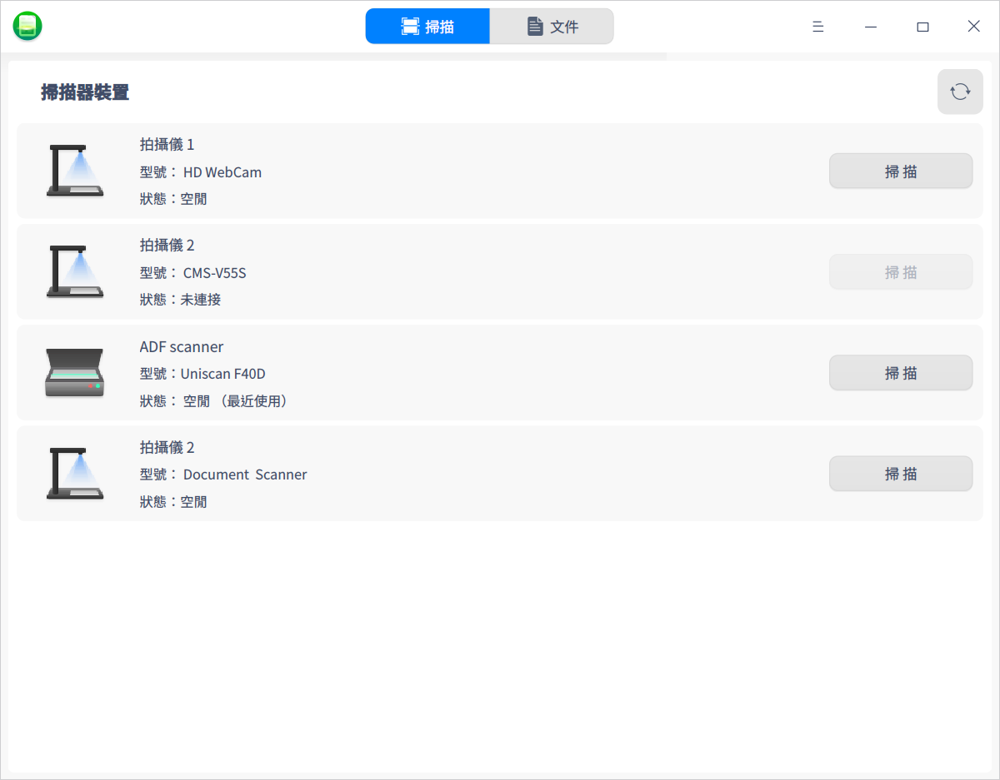
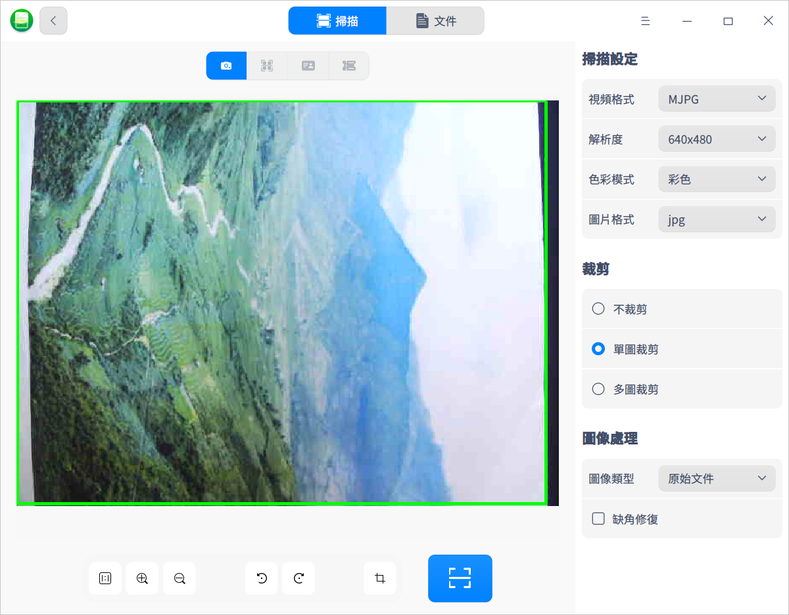
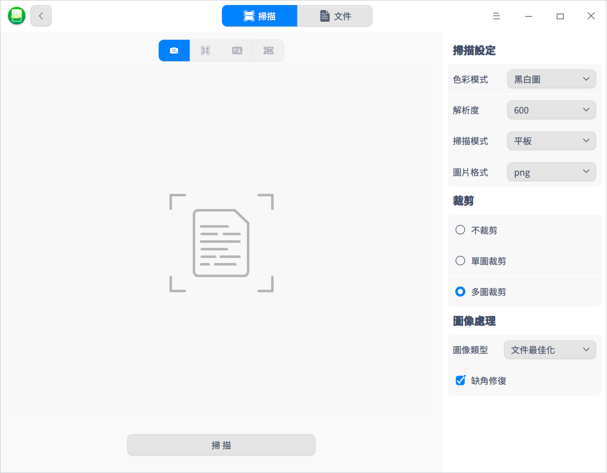
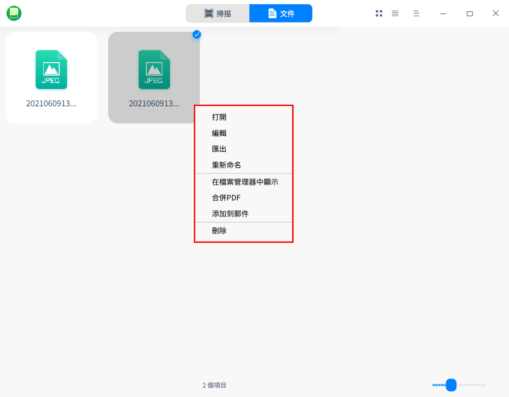
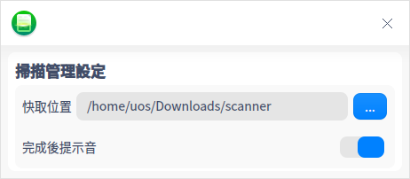

# 掃描管理器|deepin-scanner|

## 概述

掃描管理器是一款管理掃描裝置的工具，可同時管理多個掃描裝置。介面可視化，操作簡單。

## 使用入門

透過以下方式執行或關閉掃描管理器，或者建立掃描管理器的捷徑。

### 執行掃描管理器

1. 點擊桌面底部的 ，進入啟動器介面。
2. 上下滾動滑鼠滾輪瀏覽或透過搜尋，找到掃描管理器  點擊執行。
3. 右鍵單擊 ，您可以：
 - 點擊 **建立桌面捷徑**，在桌面建立捷徑。
 - 點擊 **釘選到Dock**，將應用程式固定到Dock。
 - 點擊 **開機啟動**，將應用程式添加到開機啟動項，在電腦開機時自動執行該應用。

### 關閉掃描管理器

- 在掃描管理器介面點擊  ，關閉掃描管理器。
- 在任務欄右鍵單擊 ，選擇 **全部關閉**  來關閉掃描管理器。
- 在掃描管理器介面點擊 ，選擇 **退出** 來關閉掃描管理器。

## 掃描操作介紹

將掃描裝置與電腦連接，並打開掃描裝置的開關。

打開掃描管理器，系統會自動掃描目前電腦上連接的所有掃描裝置，如拍攝儀和掃描器。如果沒有顯示對應的裝置列表，則需要安裝驅動。

### 安裝驅動

1. 在官網下載掃描裝置對應的.deb驅動安裝包。
2. 雙擊驅動安裝包，軟體包安裝器會自動啟動並準備安裝該安裝包。
3. 安裝成功後，單擊重新整理按鈕確認裝置顯示在列表中。

### 拍攝儀

1. 在裝置列表中選擇拍攝儀並單擊 **掃描**，進入掃描頁面。

2. 在右側介面可設定掃描參數，包括掃描設定、裁剪及圖像處理方案等。

   **掃描設定**：可設定掃描圖片的解析度、圖片格式及色彩模式。目前支援 jpg/bmp/tif/png 圖片格式，且支援掃描為pdf文件，支援彩色/灰度/黑白三種色彩模式。

   **裁剪**：預設為不裁剪，可選擇單圖裁剪或多圖裁剪。例如選擇「多圖裁剪」後，如果此文件顯示了多張圖片，則可以裁剪為多張圖片。

   **圖像處理**：當裁剪方式為單圖裁剪或多圖裁剪時，才可以設定圖像處理方式。例如選擇「紅印文件最佳化」可以使紅印文件的印章更加清晰。

   

3. 在頁面底部設定顯示比例，放大或縮小，旋轉及剪裁掃描區域。

4. 完成設定後，單擊掃描按鈕，掃描的圖片可以在「文件」頁面查看。

### 掃描器

1. 在裝置列表中選擇掃描器並單擊 **掃描**，進入掃描介面。
2. 在右側介面可設定掃描參數，包括掃描設定、裁剪及圖像處理方案等。

   **掃描設定**：可設定色彩模式、掃描模式、解析度及圖片格式。如目前支援彩色圖/灰度圖/黑白圖三種色彩模式，支援 ADF 正面/ADF 雙面/平板三種掃描模式等。

   **裁剪**：預設為不裁剪，可選擇單圖裁剪或多圖裁剪。如選擇「多圖裁剪」後，可以同時掃描多個文件並分別裁剪為多張圖片。

   **圖像處理**：當裁剪方式為單圖裁剪或多圖裁剪時，才可以設定圖像處理方式。例如選擇「紅印文件最佳化」可以使紅印文件的印章更加清晰。

   

3. 完成設定後，單擊 **掃描** 按鈕，掃描的圖片可以在「文件」頁面查看。

### 圖片處理

1. 在掃描管理器主介面單擊 **文件** 會顯示掃描完的所有圖片，您可以單擊圖示/列表檢視、，以圖示或列表形式查看圖片。

2. 選中圖片並右鍵單擊，可以進行編輯、匯出、重新命名、合併PDF、添加到郵件、刪除等操作。

   

   - 編輯：掃描完的圖片可以在畫板中編輯。

   - 匯出：掃描完的圖片可以直接匯出，如果圖片較多可以先合併為PDF，再匯出到指定位置的資料夾。
   - 重新命名：對掃描完的圖片進行重新命名，便於尋找。
   - 在檔案管理器中顯示：直接打開圖片所在的資料夾。
   - 添加到郵件：掃描完的圖片可以透過郵件發出，如果圖片較多可以先合併為PDF文件，再透過郵件發出。

## 主選單

在主選單中，可以進行掃描管理設定、切換視窗主題，查看說明手冊等。

### 設定

1. 在掃描管理器介面，單擊 。

2. 單擊 **設定**，設定掃描文件的快取位置，選擇是否開啟 **完成後提示音** 功能。

   

### 主題

視窗主題包含亮色主題、暗色主題和系統主題。

1. 在掃描管理器介面，點擊 。
2. 點擊 **主題**，選擇一個主題顏色。

### 說明

查看說明手冊，進一步了解和使用掃描管理器。

1. 在掃描管理器介面，點擊 。
2. 點擊 **說明**。
3. 查看掃描管理器的說明手冊。

### 關於

1. 在掃描管理器介面，點擊 。
2. 點擊 **關於**。
3. 查看掃描管理器的版本和介紹。

### 退出

1. 在掃描管理器介面，點擊 。
2. 點擊 **退出**。
